# Proyecto: Topping

## Descripción del Proyecto

El proyecto **“TOPPING”** es un sistema de gestión para una pizzería, desarrollado en **MySQL**, que permite controlar y automatizar los procesos principales de la operación de manera básica pero funcional.  

El sistema permite:

- **Gestión de clientes:** registrar información de clientes (nombre, teléfono, dirección y correo) y llevar un control de sus pedidos.  
- **Gestión de pizzas e ingredientes:** registrar las pizzas disponibles, relacionarlas con sus ingredientes y controlar el stock de los mismos.  
- **Gestión de pedidos:** crear pedidos indicando el cliente, las pizzas solicitadas, el método de pago, el tipo de pedido (domicilio o local) y el estado del pedido. Además, el sistema calcula automáticamente el total del pedido sumando el precio de las pizzas y, si aplica, el costo de domicilio.  
- **Gestión de repartidores y domicilios:** registrar repartidores, asignarlos a pedidos de domicilio y controlar su disponibilidad. También se lleva un registro de la distancia, hora de salida y hora de entrega de cada domicilio.  
- **Automatización básica con triggers y funciones:** actualizar automáticamente el total de un pedido, ajustar el stock de ingredientes, auditar cambios de precios y actualizar el estado de los repartidores.

Este proyecto busca **simular un entorno real de una pizzería**, permitiendo practicar conceptos de bases de datos relacionales como relaciones uno a uno, uno a muchos, muchos a muchos, y la implementación de triggers, procedimientos y funciones para automatizar procesos.

--- 

### Tabla Persona
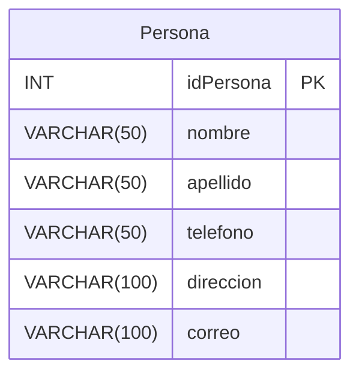
La tabla `Persona` almacena la información básica de todas las personas relacionadas con el sistema: clientes, vendedores y repartidores. Su clave primaria es `idPersona`.  

---

### Tabla Cliente
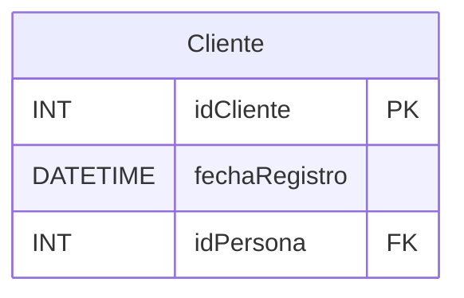
`Cliente` representa a los clientes de la pizzería. Está vinculado a la tabla `Persona` mediante `idPersona` (FK), ya que cada cliente es una persona registrada.  

---

### Tabla Vendedor
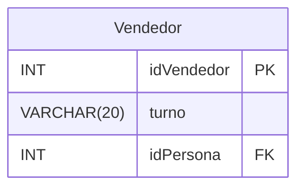
`Vendedor` almacena los empleados que toman pedidos. Cada vendedor también es una persona (`idPersona` FK) y tiene un `turno`.  

---

### Tabla Zona
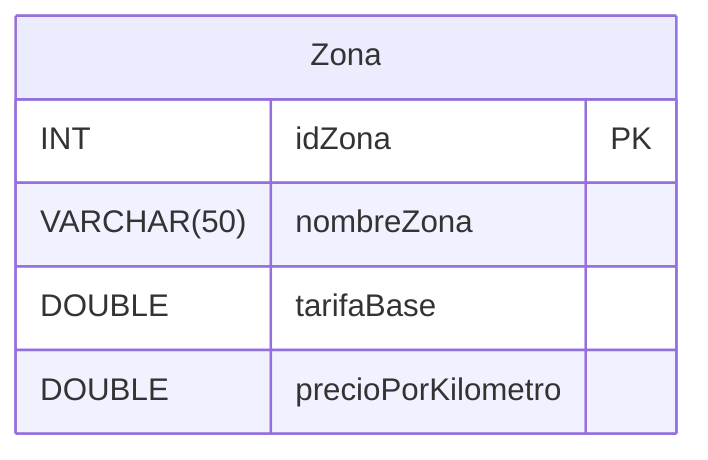
`Zona` define las áreas de entrega. Cada zona tiene un `tarifaBase` y un `precioPorKilometro` para calcular el costo de domicilio.  

---

### Tabla Repartidor
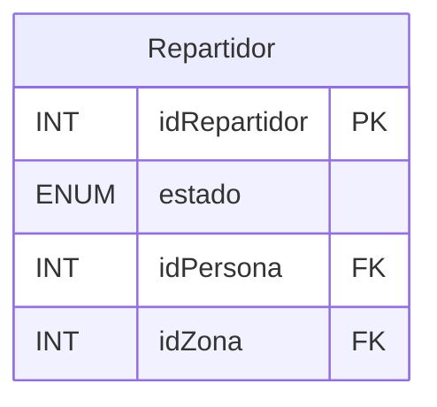
`Repartidor` registra los repartidores disponibles para domicilios. Se relaciona con `Persona` (información personal) y `Zona` (área asignada). El `estado` indica si está disponible, en entrega o inactivo.  

---

### Tabla Pizza
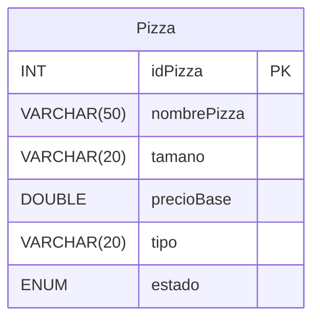
`Pizza` contiene las pizzas disponibles, con su `nombre`, `tamaño`, `tipo` (vegetariana, especial, clásica) y `precioBase`. El `estado` indica si está activa o no.  

---

### Tabla Ingrediente
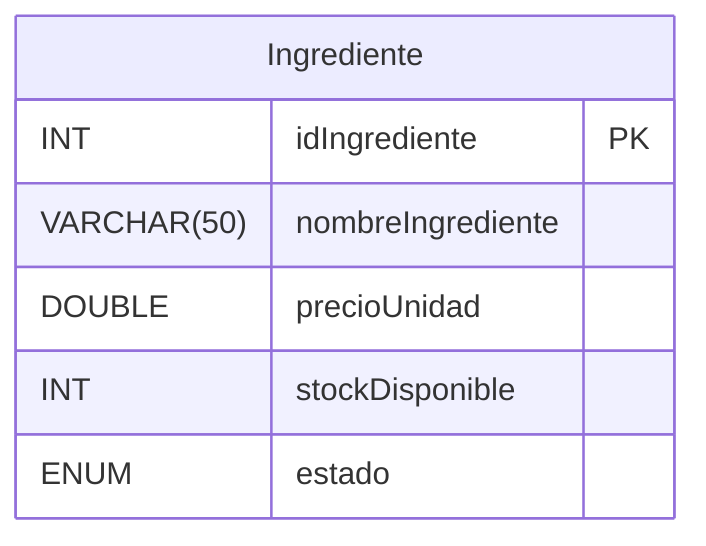
`Ingrediente` almacena todos los ingredientes posibles para las pizzas, su precio y stock. El `estado` controla si está activo o inactivo.  

---

### Tabla PizzaIngrediente
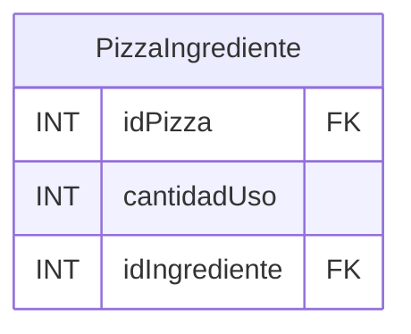
`PizzaIngrediente` es la relación muchos a muchos entre `Pizza` e `Ingrediente`. Indica cuántas unidades de cada ingrediente se usan en cada pizza.  

--- 

### Tabla MetodoPago
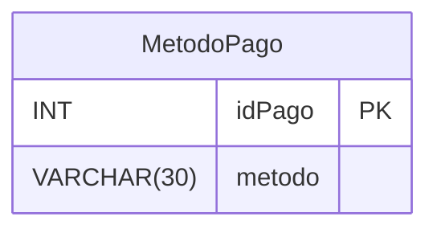
`MetodoPago` almacena los métodos de pago posibles: efectivo, tarjeta o app como Nequi.  

---

### Tabla Pedido
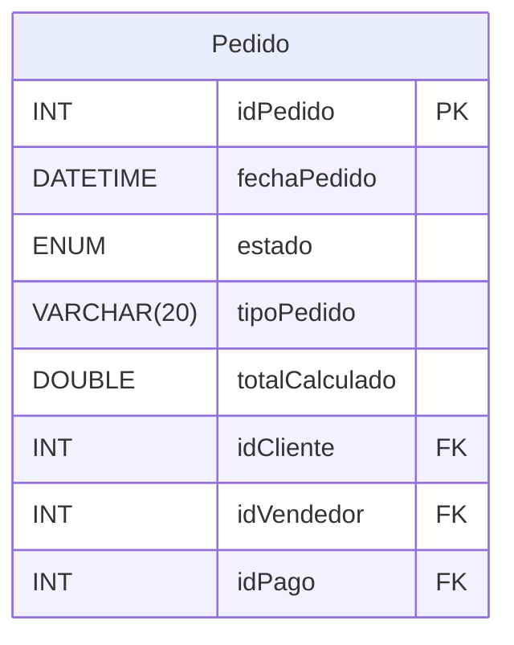
`Pedido` registra cada pedido realizado, el cliente que lo hace, el vendedor que lo atiende y el método de pago. Se almacena el tipo (`local` o `domicilio`), estado y total calculado.  

---

### Tabla DetallePedido
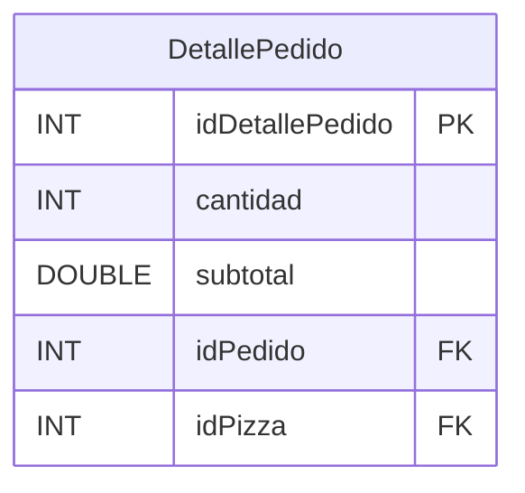
`DetallePedido` almacena cada pizza incluida en un pedido y su cantidad. Cada detalle está vinculado a un `Pedido` y a una `Pizza`.  

---

### Tabla Domicilio
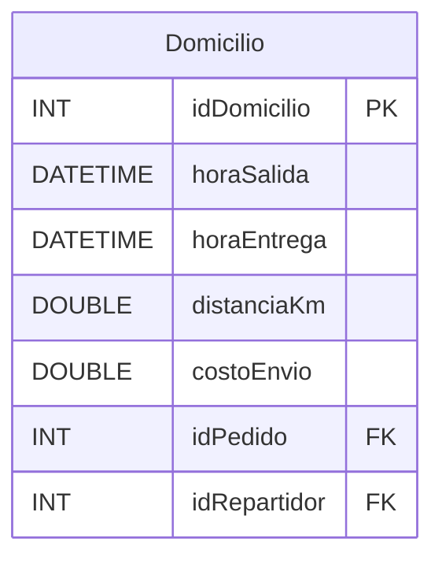
`Domicilio` registra los pedidos enviados a domicilio: horas de salida y entrega, distancia recorrida, costo y repartidor asignado. Cada domicilio pertenece a un pedido.  

---

### Relaciones principales

- Una **persona** puede ser cliente, vendedor o repartidor.  
- Un **repartidor** está asignado a una **zona**.  
- Una **pizza** puede usar muchos ingredientes (PizzaIngrediente).  
- Un **cliente** puede realizar muchos pedidos.  
- Un **pedido** tiene varios detalles (pizzas) y puede generar un domicilio.  
- Un **repartidor** reparte los domicilios asignados.  
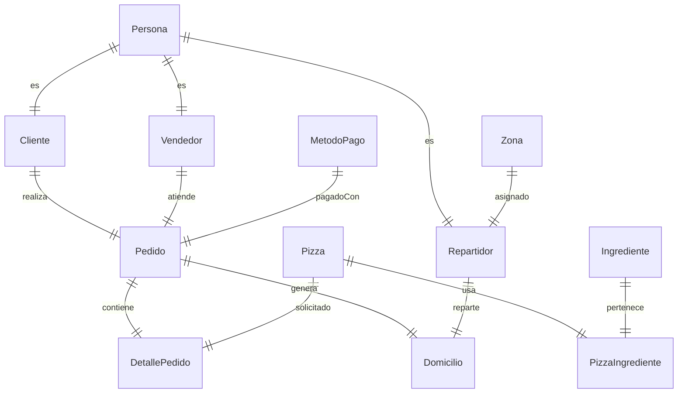

